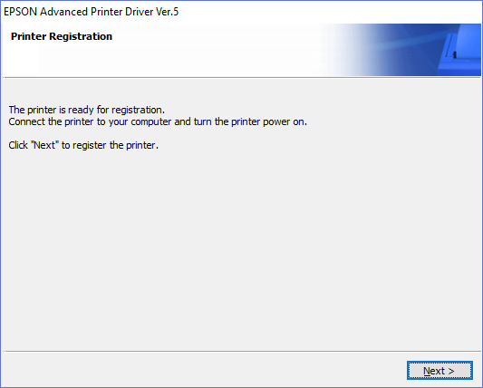
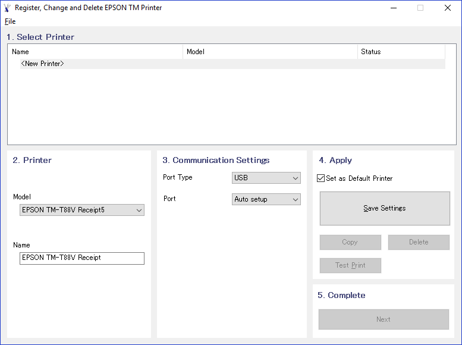

# Receipt Printer

This topic covers the installation and configuration of the EPSON T88V Receipt Printer for use in REV23 Desktop. While other receipt printers may work, they are unsupported by REV23 Support and you'll need to contact the manufacturer.

Epson T88V Receipt Printer Driver Download
To use the Epson T88V Receipt Printer in REV23 Desktop and Microsoft Windows the proper driver needs to be installed. Unfortunately, Epson doesn't make finding the proper driver particularly easy.

The Epson T88V Advanced Printer Driver is required. As of the time of this writing, the version is 5.05.

You can download this version directly from us at the link below.

- [**Recommended REV23 Download**](https://download.rev23.com/public/hardware/apd_505r1_t88v_ewm.zip)
- [EPSON Download](https://epson.com/Support/Point-of-Sale/Receipt-Printers/Epson-TM-T88V/s/SPT_C31CA85011)
- [EPSON Website](http://www.epson.com)

Epson T88V Receipt Printer Installation
Extract the files from the downloaded driver package and follow the prompts to install. Once complete, the printer should be ready for registration.

Printer Registration is the final step of driver installation.

When registering the printer, you should be prompted to install a new Printer (see screenshot below). Our steps below correspond to the step numbers in the application.

1. Select **&lt;New Printer&gt;**

2. Verify the model is detected. Changing the name is not recommended as REV23 Desktop uses the default name to configure our default settings for receipt printer functionality.

3. Change the **Port Type** to *USB*.

4. Click **Save Settings** (optionally set as your default printer). You will be prompted to print a test page. Go ahead and make sure things are working.

5. Complete, click **Next**.

## Changing Epson T88V Paper Size

There is a lot to this printer honestly, sometime even we fumble around with this thing so you may need to hit their own user guide. To do basic things such as changing the paper size you have to set it in a few different areas. We'll walk you through that here.

On your PC open Control Panel and navigate to "Devices and Printers."

Devices and Printers Control Panel applet.

1. Right click the Epson T88V Receipt Printer and select "Printing preferences."

2. Click the Advanced button on the layout tab to open the printer's Advanced Options.

3. Set the Paper Size to the desired size and click OK. 80 mm is recommended, but we also support 58 mm.

4. When returning to the Printing Preferences dialog, click the Advanced Settings tab.

5. Click the "Advanced Settings" button.

6. Navigate to "Printing Control" and change the the Paper width setting to match your previous selection in step 4 and click the "Set" button.

7. Close this dialog. You should be good to go!

Again, you can configure all sorts of stuff with this printer. We recommended just leaving the defaults, but do what works for you, we just can't really help you with it beyond our default preferences and what we know works well.