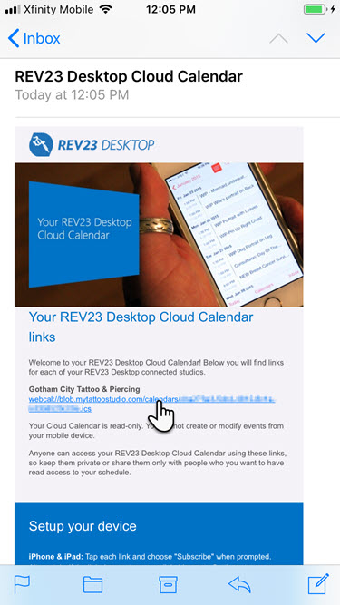

# How to: Setup an iOS Device to fetch Cloud Calendar automatically

On an iPhone or iPad, REV23 Desktop Cloud Calendar needs to be setup to fetch the automatically to keep the device in sync with the calendar. If these steps are not performed, the calendar on your device will be out of date with your REV23 Desktop calendar, causing you to potentially miss, or double book appointments!

Follow these steps to make sure your device is always in sync!

## Subscribe to Cloud Calendar

1. When first setting up Cloud Calendar, you'll receive an email with your personalized link. Tap the link.

2. Your device will prompt you to Subscribe. Tap the 'Subscribe' button.

3. Then tap 'Done'

Here are the important steps to ensure your device stays up to date!

4. Open the Settings app on your device.

5. Tap 'Passwords & Accounts'

6. Tap 'Fetch New Data' at the bottom of this screen.

7. In the Fetch New Data screen, set the schedule to the desired time to sync. Hourly, Every 30 minutes, or Every 15 minutes. This must be set. Selecting 'Automatically' will not keep your REV23 Desktop Cloud Calendar in sync!!!

8. Next, tap your REV23 Desktop Cloud Calendar in the list of subscribed calendars.

9. Change this the Schedule to 'Fetch'

Following these steps will ensure your iPhone or iPad will stay up to date with the latest changes to your calendar.
