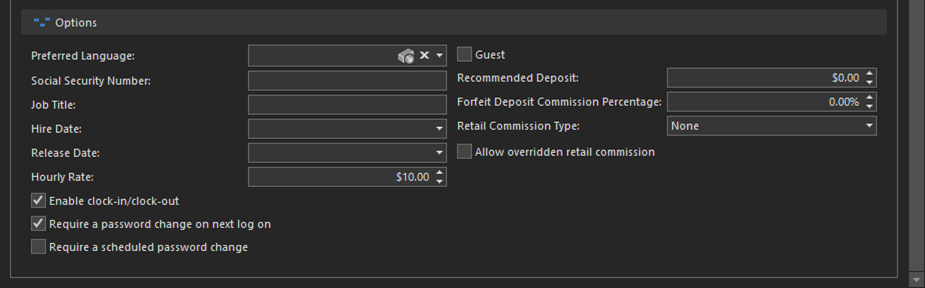

# Quick Start: Add a Manager

When you first install REV23 Desktop an Administrator user is created, as well as user for the owner which is assigned to the Manager role.

REV23 guidance is to *not* use the Administrator account unless you're making configuration changes or need to correct data. Using an account with the least amount of permissions possible to get the job done is always the best policy.

In addition to hiring Selina as a piercer, Harley has also made her the shop manager.

1. Navigate to **Security > Employees**.
2. Double click the user.
3. Click the **Add Roles** action.
4. Select the **Manager** role and click **OK**.
   > You do not need to add a manager or owner to every role available. The Manager role is a special role which contains all permissions and in fact, having other roles in addition to the Manager role can result in degraded permissions.
5. Check the **Enable clock-in/clock-out** checkbox.
6. Set the Hourly Rate to `$10.00`.
7. Check the **Require a password change on next log on** checkbox. This user's password is currently empty. They will set it when they log on for the first time.
   
    

8. Click the **Save & Close** action.

Selina is now a Manager, who will receive $10.00/hour and record her time using the [Time Clock](../concepts/time-clock.md).

Additionally, when she logs on for the first time, her password will be empty. Logging on with no password will prompt her to create a new password that she'll use from that point on.

Since we're halfway through the day and still configuring some things, we'll stay logged on as Administrator and have her log on tomorrow.