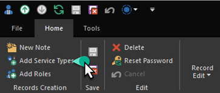
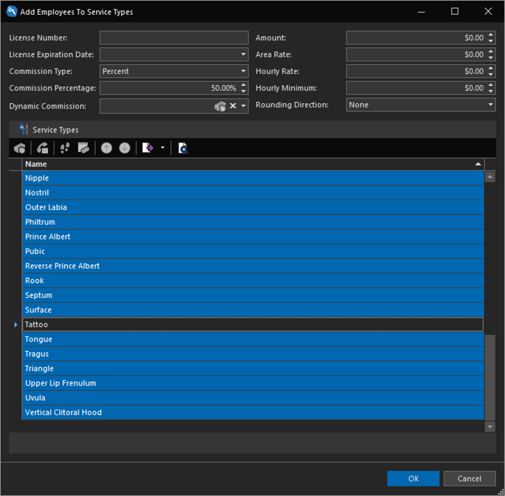

# Quick Start: Add a piercer

In the previous topic, [Add a tattooer](add-a-tattooer.md), we added Pam as a tattooer to REV23 Desktop. Adding a piercer can be done using these same steps, however, in the [Assign service types](add-a-tattooer.md#assign-service-types) section, when we added the tattoo service type, we added just the single Tattoo service type. The piercing family, having many more types of services would be time consuming to add one-by-one. So, while you can do that, there is a better way to do it.

## Using the Add Service Types Action

In the Employee List View, as well as the Employee Detail View, there is an action in the ribbon for adding multiple service types to one or more artists all in just a few clicks.

1. Create a new Employee record for the piercer and fill out the necessary information. For the purpose of this Quick Start we'll also add Selina to the **Manager** role in addition to the usual **Service Provider** role.
   
2. Click the **Add Service Types** action.

    

The Add Service Types action allows you to set the usual properties, such as commission type and percentage. The key difference is you're also able to select multiple service types, adding them all to the artist at once.

3. Set the **Commission Type** to `Percent` and the **Commission Percentage** to `50%`.

4. In the Service Types List we will select every service type *except* Tattoo. To do this, click into the list and hit **CTRL+A** on your keyboard to Select All.

5. Scroll to the bottom of the list and find Tattoo. While holding the **CTRL** key on the keyboard, click *Tattoo* to deselect it. If done properly, every service type except Tattoo will now be highlighted.

    

6. Click **OK**.

We've now added Selina to all piercing service types in just a couple of clicks.