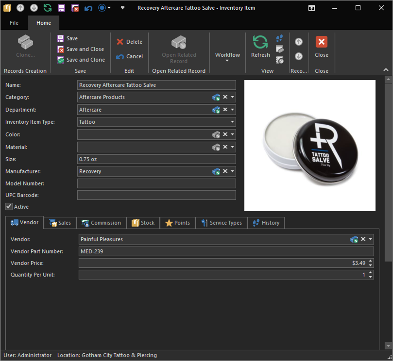

# Quick Start: Add a retail item

Depending on your shop, you may have little to no products to sell, or possibly a whole lot of jewelry to sell. Inventory can become quite an advanced topic, so for the sake of this quick start, we're going to focus on simple aftercare products, ignoring the details and just getting it ready to sell.

The **Inventory Item List View** is a slightly different from other list views, in that it has an additional section on the left which displays [Inventory Categories](../configuration/inventory-categories). This, as the name implies, allows you to categorize your inventory items into a folder like structure for easy navigation. REV23 Desktop already comes configured with what we believe to be well structured categories, however you're free to reorganize these to your liking. That is however, outside of the scope of this quick start.

1. Navigate to **Inventory > Inventory Items**. 
2. Ensure that the **Aftercare Products** category is selected in the tree list on the left and click the **New** action.
3. Enter basic item information:
    - **Name**: Name of the item. 
    - **Category** Since the Aftercare Products category was selected when we first created the item, the **Category** is already set for us. 
    - **Department:** And since this is a default category, REV23 Desktop already knows the department. 
    - **Inventory Item Type:** Set to `Piercing`, since this is piercing specific aftercare. 
    - We can also add an [**Image**](../ui/editors.md#image-editors), the **Manufacturer** and **Vendor** information. Again. you can include as little or as much information here as you'd like.
    - **UPC Bar code**: If the item has a UPC from the manufacturer, type or scan it in to this field.

    

4. Click the **Sales** tab and set the following options.

    

    - **Sellable:** Check this to make the item sellable.
    - **Sale Price:** Enter the amount to sell the item for.
    - **Tax:** Select your tax code for this item.

5. Click the **Save & Close** action in the Inventory Item Detail View to close and return to the Inventory Item List View.

Our item has been saved and is now visible in the Inventory Item List View Catalog and is ready to be sold. 

Try creating a new item for tattoo aftercare using these same steps.