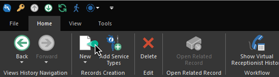
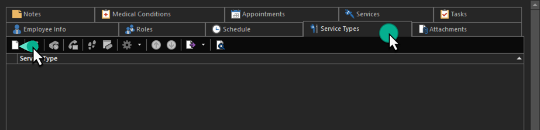
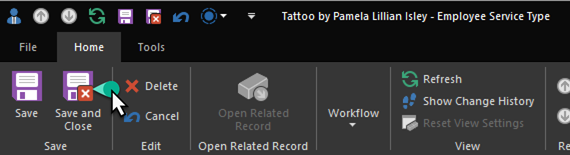
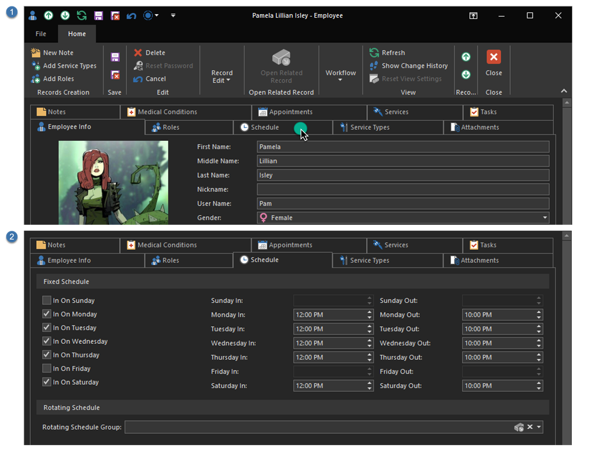

# Quick Start: Add a tattooer

Since Harley is the user who installed REV23 Desktop and went through the setup wizard, an account for her was automatically created and added to the *Manager* role. However, we will still need to add Pam as a tattooer (in the Service Provider role) and Selina as a body piercer and manager.

## Create a new user

1. Use the navbar to navigate to **Security > Employees**.

    

2. Click the **New** action on the ribbon. The Employee Detail View will appear.

    

3. Fill out the basic information for the user. We've filled out the standard details, such as her name and gender and you can get as detailed (or basic) as you want with this information. There are additional properties you can explore now, but are outside of the scope of this quick start. Here are the things you should pay attention to now:

    - **User Name:** User name is required. Usually a first name will be acceptable, or first initial + last name. Whatever works for you!
    - **Email address:** Preferably one they can check using their mobile device. If you're going to set them up to see their schedule from their phone, this is the email address the instructions will go to.
    - **Mobile Phone + Provider:** This will allow this user to receive text messages from the system, for example if a client cancels an appointment within 24-hours, the artist can be notified by text.
    - **Use Calendar:** Whether this person will be visible on the shop's calendar.
    - **Display Color:** The appearance of this user on the schedule.
    - **Display Order:** The order in which the user will appear on the schedule. The lower the number, the earlier they appear.
    - **Use Cloud Calendar:** Whether the users calendar is uploaded to REV23 Cloud Calendar.
    - **Require a password change on next log on:** By default, new users have an empty password. Checking this option will force them to select a new password when they log on for the first time.

    

## Assign Roles

[Roles](../security-concepts/roles.md) are security permissions this user will have access to when they log on. In this case, we are going to assign the user to only to the Service Provider role. They will be able to see their own services, and schedule appointments for themselves, but other than that, they do not have much access to the system.

4. Click the **Add Roles** action in the ribbon.

    

5. Select the **Service Provider** role.

    

6. Click **OK**.

    > Pro Tip: You can select multiple roles by holding down the **CTRL** key on the keyboard while clicking each role.
    
## Assign Service Types

Since this user is a tattooer, we need to tell REV23 Desktop that she perform the Tattoo service type, as well as how they are paid for it.

7. Click the **Service Types** tab
8. Click the **New** action in the Service Types Nested List View.

    
    *The Service Types Nested List View*

    
    *The Employee Service Type Detail View*

    Set the following properties:
    -  **Service Type:** Tattoo
    -  **Commission Type:** Percent
    -  **Commission Percentage:** 50%

9. Click the **Save & Close** action, *or* **CTRL+ENTER** on your keyboard to save this record.

    

> Obviously, this would be time consuming to add a piercer's service types this way. Don't worry! We will demonstrate a shortcut to this in the next topic when we [add a piercer](add-a-piercer.md).

## Finish up

10. Click the **Schedule** tab to set this user's schedule. Select the days and times they are available in the Fixed Schedule group.

    

11. We're now done with this user. Click the **Save & Close** action, *or* **CTRL+ENTER** on your keyboard to save this record and close the Employee Detail View.

We've now added a tattooer to REV23 Desktop, and you should have learned some basic concepts about how to navigate around the software, create new objects and save those objects.