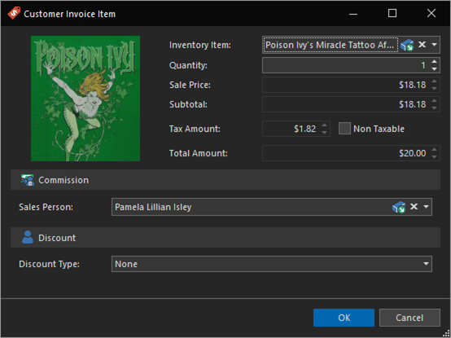
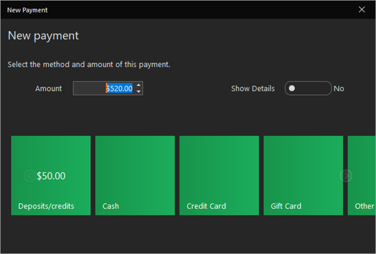
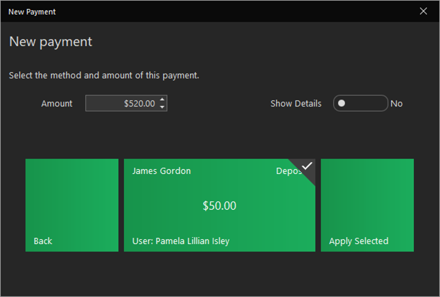

# Quick Start: Apply a deposit

The Commissioner's new tattoo looks awesome thanks to Pam, and he's ready to pay. He put down a $50.00 cash deposit yesterday when he scheduled the appointment, so we need to make sure that is applied.

We will use the same steps as when we [started a sale](start-a-sale.md) for the walk-in piercing yesterday.

1. In the Today Dashboard, highlight the in progress service and click the **Sale** action.

2. Late last night, Pam formulated Poison Ivy's Miracle Tattoo Aftercare, specifically for Commissioner Gordon. She explains a couple of dabs on the new tattoo will heal it up in just hours, completely skipping the itching and peeling stages of a new tattoo. He's reluctant, however trusts she has turned over a new leaf. Add the item using the **Add Sale Item** action.

    

3. Click the **Take Payment** action. This time you will see a new tile showing available deposits/credits. You can chose to apply these deposits, or roll them forward if you're doing session work. We will apply it since Pam has finished this tattoo.

    

4. Click the **Deposits/credits** tile. This will present us with the deposits/credits the client has available. Click each deposit/credit tile you wish to apply (the client may have multiple deposits or credits available). If you wish to apply a partial deposit amount, you can change the amount field. If you leave the amount greater than what is available, it will authorize only the available amount. Click the **Apply Selected** tile.

    
    
    After applying the deposit (or taking a payment), if there is still a balance, the New Payment window will open again. This time, you'll notice there are no deposits or credits to use. You can split the sale into as many payments as you need, for example, multiple credit cards, until the balance is zero.

5. The client will put it on his Visa card. Harley already set up her CardConnect account and and will click the **Credit Card** tile. If you have not yet set up your integrated processing account or are in a currently unsupported region, you can click the **Other** tile and select the card type.

    

    Gordon leaves a 20% tip and the sale completes.

6. The balance is now fully paid, and we can **Save & Close** the sale to wrap things up with a receipt and printed aftercare. Commissioner Gordon walks out a happy customer. For now...