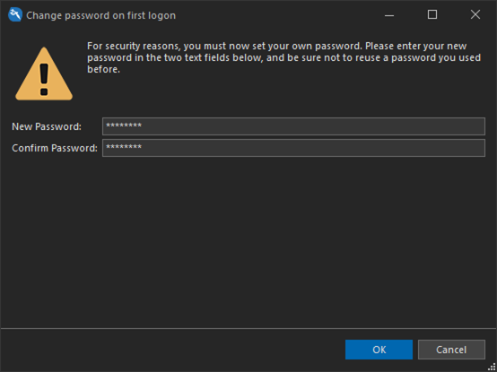
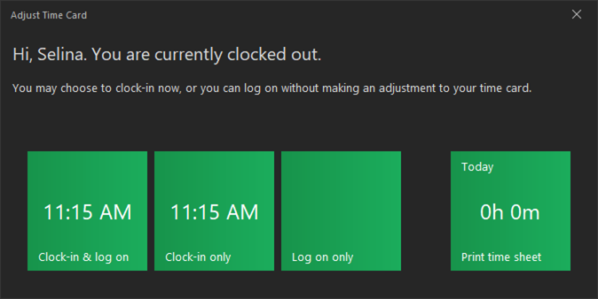

# Quick Start: Clocking in

It's the second day of Gotham City Tattoo & Piercing's grand opening!

Selina has arrived and is ready to start work for the day. In addition to piercing, Selina receives hourly wages. REV23 Desktop can track this using the Time Clock. When we added Selina as a Manager, we checked the **Enable Clock-In/Clock-Out** checkbox editor in the Employee Detail View, as well as set her hourly rate.

1. If you're already logged in as any user you will need to log off. You can log off of the software using the File menu in the top left hand corner of the ribbon. There is also a **Log Off** action on the very top left hand corner in the Quick Access Toolbar (above the file menu).

2. Select Selina in the User editor. Since this is Selina's first time logging on, her password is blank. Leave the Password editor empty, then click the Log On action.
   
    

3. When we added Selina as a manager, we checked the **Change password on next log on** checkbox. She will now be prompted to create a password for herself. Enter a new password and confirm it, then click **OK**.

    

4. Because Selina is set up to use the Time Clock, each time she logs on, she will be prompted with what to do with her time card. REV23 Desktop indicates she is currently clocked out. She has following options.

    - **Clock-in & log on:** This will clock her into the system and continue to the Main Window with her being the currently active user.
    - **Clock-in only:** This will clock her into the system, but return to the log on screen.
    - **Log on only:** The system will not clock her in but continue to the Main Window with her being the currently active user.
    - **Print time sheet:** The user can print a report with their current hours. This tile will flip to show their hours for the current day, as well as the current week so they can see this information at a glance.

    

Selina is assigned to the Manager role and will have all the permissions we need, so we will **Clock-in & log on**.

Commissioner Gordon has a tattoo scheduled for this afternoon and will be here shortly.