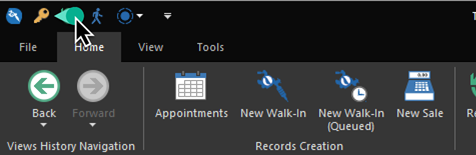

# Quick Start: Clocking out

It's been a crazy grand opening at Gotham City Tattoo & Piercing, and Selina is ready to clock out for the night.

1. Click the **Log Off** action on the Quick Access Toolbar to show the log on screen. Even if Selina was the logged on user, you still need to return to the log on screen by first logging off. This is a security feature of REV23 Desktop so that the password is required for clocking out as well.

    

2. Type the password for Selina, and click **Log On**.

    

3. Click the **Clock-out** tile.

    

Selina is clocked out and ready to enjoy her night! Tomorrow is another day at Gotham City Tattoo & Piercing.