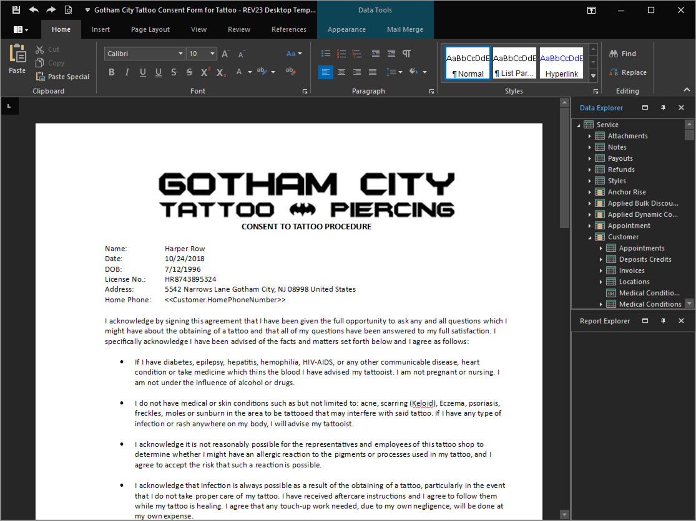
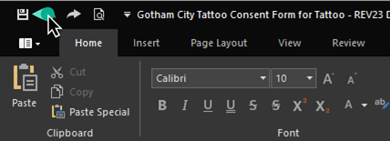
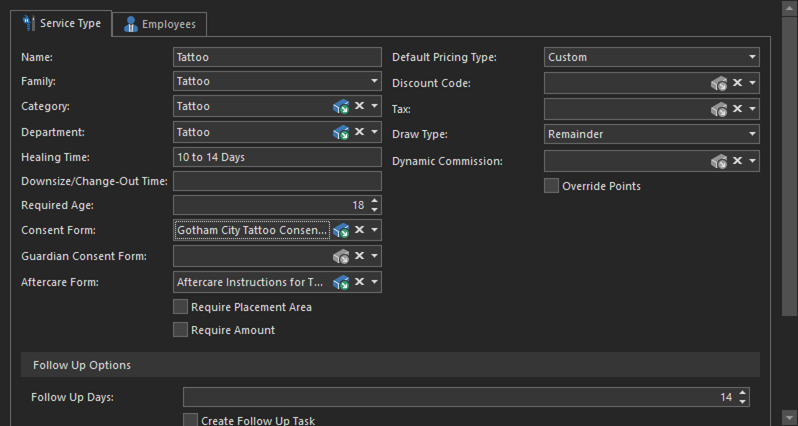

# Quick Start: Modify consent form

We noticed a few things on the release forms earlier that we'd like to change, so now seems like a good time to get that taken care of.

Consent and Aftercare forms, as well as other various bits of text, such as the text message and email appointment reminders, exist as Templates, which we will edit using the **Template Designer**.

## Open the Template Designer

1. Navigate to **Configuration > Templates** to open the Template List View.

2. Select the `Consent Form for Tattoo (REV23)`, and click the **Clone** action. This will open the Template Detail View for our newly created copy.
   > Cloning an object creates a copy. In the case of templates, any template that is built into REV23 Desktop is overwritten each time a new update is installed. By creating a copy, we ensure that our changes are not overwritten.

3. Provide a new **Name** to make this easily recognizable as your copy.

4. Click the **Show Template Designer** action on the ribbon to open the Template Designer.

    

The Template designer is a full word processor that allows you to format your templates however you'd like, as well as insert fields that are populated from the database. The Template Designer itself is a complex topic, so here we will only cover the basics and make a couple of changes.

Looking at the Template Designer, we can see some data already exists from a service we created earlier. These are only **previews** of the Service records we created earlier and will not be saved when you save the template. It will randomly show you a record so that you can see what the template looks like with actual data. This is useful so you can see what longer names or larger IDs do to the formatting of the template and make sure to adjust for them. Don't worry, this data is not saved to the template and is only there for preview purposes.

> Even though we are modifying the Tattoo Consent Form you may see a piercing service. That's ok. You can change the record you're looking at by using the **Mail Merge** tab on the ribbon and changing the **Current Record** editor to scroll through up to 50 records. 

We see a couple of changes we'd like to make. First, we can get more text on the form by changing the margins.

4. Click the **Page Layout** tab.
   
5. Click the **Margins** button and select *Narrow* as the margin choice.

    

Now we'd like to update the consent form to use the **Mobile Phone Number**.

1. Erase the entire line that says `Home Phone: <<Customer.HomePhoneNumber>>` and replace with `Mobile Phone: ` and leave the cursor blinking in that spot.
   
    

2. On the right hand side of the Template Designer is the **Data Explorer**. This allows us to insert a field which will read data from the database. In this case, a release form is based on the Service data type, so we can access all properties of a Service here. Scroll to the top of the data explorer window.

    

Notice the arrows next to some Properties (those that contain other properties.) For example, the *Customer* is a property of *Service*, and *Mobile Phone Number* is a property of *Customer*. So, we'll need to expand the Customer property to see what we have access to.

8. Locate the `Mobile Phone Number` property nested inside the Customer Property (**Service > Customer > Mobile Phone Number**). Double click it to add it to the spot where the cursor is currently blinking. You can also click and drag it to the spot you'd like.

    

    We're now properly displaying the mobile phone number.

    > If the current record does not have a value for that property you will see the place holder value.

Our template looks pretty good, and we can come back to it later at any time to add additional details or formatting. But now, we need to tell REV23 Desktop to use this template instead of the default.

9. Save the Template using the **Save** action in the top left corner of the Template Designer to close it.

    

10.  Click the **Save & Close** action in the Template Detail View.

## Set the service type consent form

Now we need to instruct REV23 Desktop to use our custom release form instead of the default one.
    
11.  Navigate to **Configuration > Service Types**

12.  Locate the `Tattoo` service type in the Service Type List View and double click it to open the Service Type Detail View. This detail view should look familiar as we saw it earlier when we were setting service prices.

13. Change the **Consent Form** property to the new template we just created.

    
    
14. Click the **Save & Close** action to close the Service Type Detail View.

That's it! We've now created a new template for our Tattoo Consent Form and have told REV23 Desktop to use it for tattoos instead of the default.

Repeat this process for any additional service types that will use this same template.

Harley will also modify the piercing consent forms using these same steps, as well as the Aftercare Forms, where you will use th **Guardian Consent Form** and **Aftercare Form** properties of the Service Type.

> Templates are versatile and easily reused. For example, you don't need a different template for each piercing type. Using the values from each service type, you're able to insert fields for the name, healing time, etc.. so don't create more templates than you really need. Now that you have your own copy, any time you edit it, the service type will automatically pick up these changes, and you do not need to repeat the step of setting it in this step.