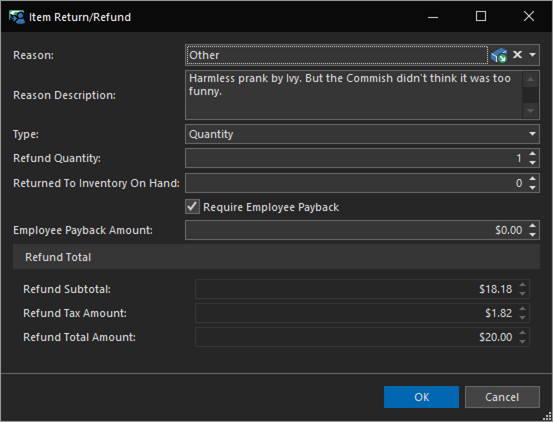
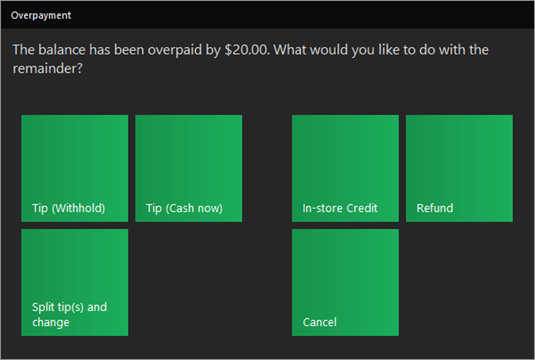
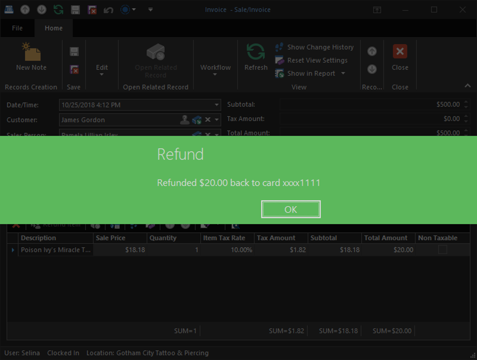

# Quick Start: Refund an item

No other appointments were scheduled for the day and no one else came in, so the girls spent some time decorating the studio and tightening up some loose ends.

Shortly before closing time, Harley hears some commotion up front. Commissioner Gordon has returned a few hours after he left from getting his new tattoo, and he is furious. It turns out, *Poison Ivy's Miracle Tattoo Aftercare* has caused him to break out with a terrible ivy-like rash. Pam was just having a little harmless fun, but Harley wants to keep him happy and agrees to refund the Commissioner for the item.

1. Navigate to **Home > Sales & Invoices** and locate the sale. Double click to open it.

2. Click the **Items** tab, and select the item we want to refund.

3. Click the Refund Item action on the nested list view.

    

4. In the Return/Refund Detail View, select a reason for the return in the Reason editor, and click OK.

    

5. The balance now shows the client is owed back $20.00 and there is a Refund Pending.

    

6. Click the **Save & Close** action on the Sale Detail View. You will be prompted with what to do with the overpayment. Click the **Refund** tile.

    

    The $20.00 credit on that deposit is now refunded.

    

Commissioner Gordon has a good laugh with Ivy while tightly clutching his wallet. She's given him a special ointment that instantly removes the rash. He's forgiven her, and will probably return due to the outstanding customer service.