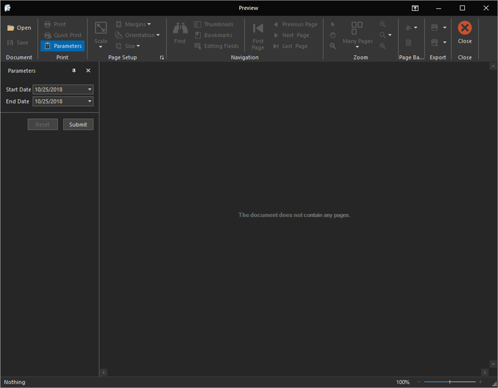
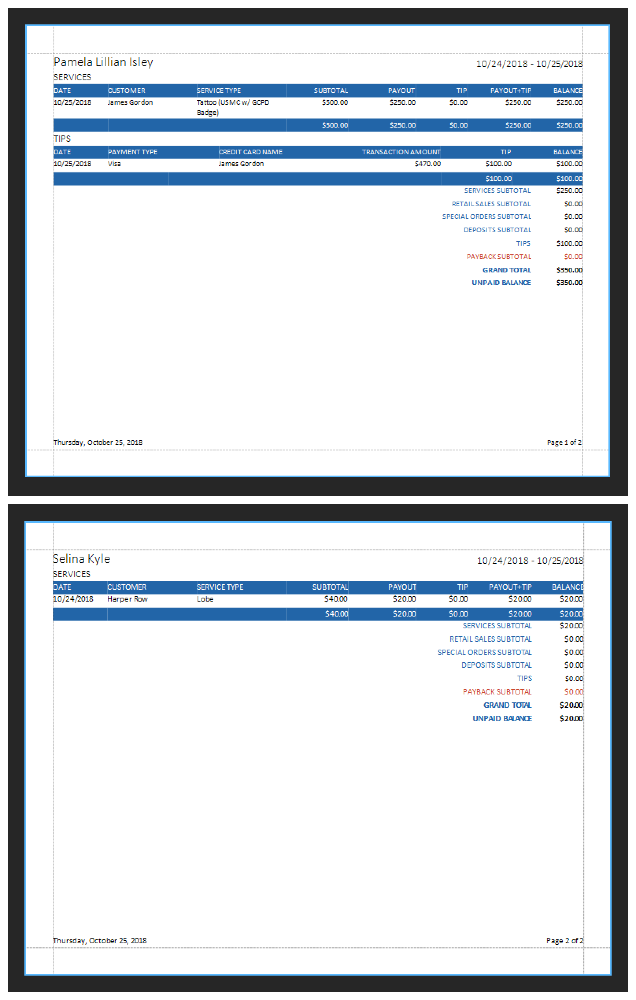
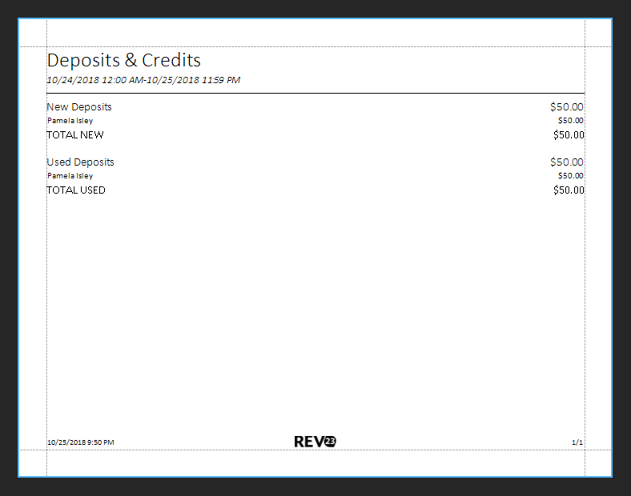

# Quick Start: Run reports

Well, the day is about at a close at Gotham City Tattoo & Piercing. Let's run a couple of reports to see how things look.

1. Navigate to **Reports > Reports**.
2. Double click the Commissions report to run it.

    

    Most reports from REV23 will require parameters to be set. Generally, these are dates, to execute the report for a particular date range.

3. Set a **Start Date** and **End Date** in the parameters panel. We will run it for yesterday and today to view everything we've done during this quick start.
4. Click the **Submit** button.

    

    The Commissions Report contains information for each artist and the commissions they've earned during this time period. You can print this out and hand it to each artist with their check.

5. Close the Commissions report.
     
6. Double click the Deposits & Credits report. Again, set a Start and End Date in the Parameters panel, and click the **Submit** button.

    
    The Deposit & Credit report shows the deposit we took yesterday as well as it being used today.

7. Double click the Payments report. Again, supply a Start and End Date parameter. This time, we will also set **Show Detail** to `Yes` and click the **Submit** button. We can see a list of transactions that occurred.

    

    We can balance the cash drawer with this report to ensure that everything is accounted for.

There is no shortage of reports you can run in REV23 Desktop.

After a long day, Selina is itching to get out of here for the night and is ready to clock out.