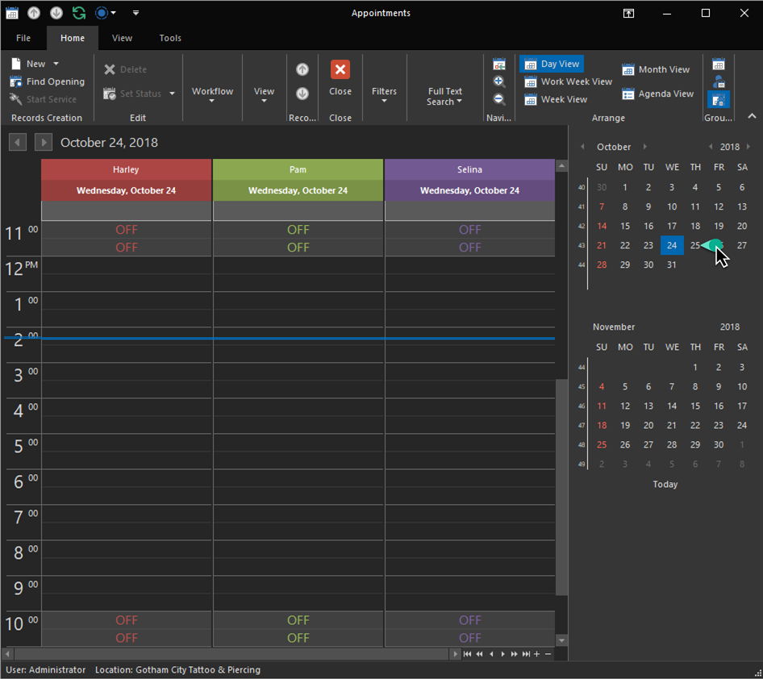
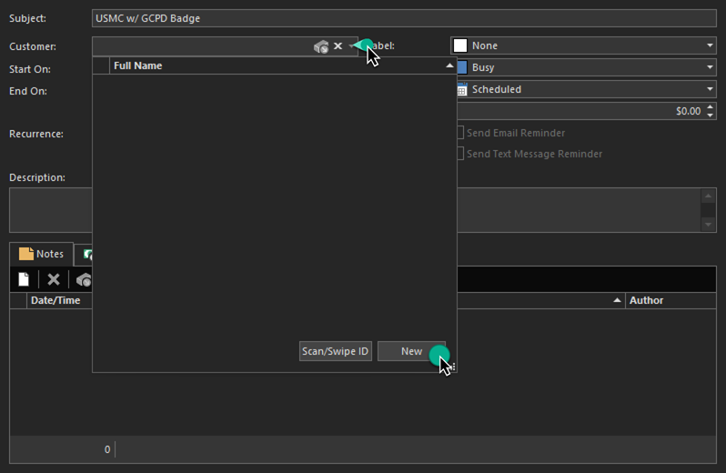
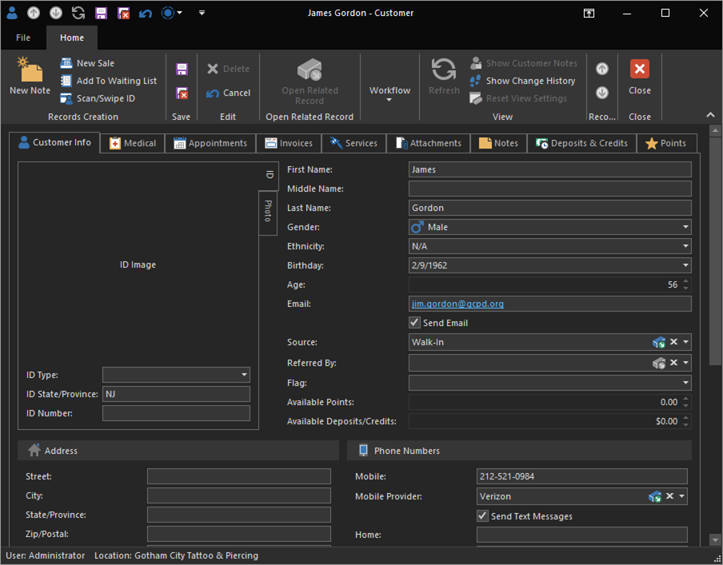
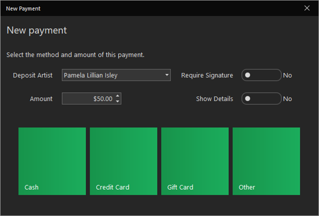

# Quick Start: Schedule an appointment

Appointments are a critical piece of the tattoo industry! REV23 Desktop features an advanced scheduler, as well as deposit tracking. 

Gotham City Police Commissioner, Jim Gordon was out for a run when he passed the new studio. He's come in to check it out and decides to schedule an appointment with Pam for tomorrow. Luckily, while jogging, he always keeps some cash tucked in his sock so he has the ability to put down a deposit.

1. From the Today Dashboard click the **Appointments** action to open the Scheduler *-OR-* navigate to **Home > Appointments**. Either way will take you to the scheduler.

2. Navigate to the date we want to schedule for using the Date Navigator on the right. We'll see a nice wide open spot for Pam (in the green column) that we can schedule an appointment for. You can also use the Find Opening action to search for an available spot.

    

3. Click and drag in the time slot you would like to schedule for. With the selection made you can right click and select New Appointment from the menu.

    

4. Fill out details of the appointment.

    - **Subject:** Required. Can contain as little or detailed information as you like.
    - **Customer:** Recommended. Search for an existing customer, create a new customer, or scan a customers ID using the barcode reader or magnetic stripe swipe reader.
    - **Description:** Optional. Additional information about the appointment.
    - **Label & Status:** Optional. A color coded label for this appointment. Can be customized in Appointment Labels.

5. Click the **Customer** editor to show the Customer Lookup List View. Since this is a new database we need to create a new customer. On the bottom of the Lookup List View there are two actions. **New** and **Scan/Swipe ID**. Since the client doesn't have his ID with him right now, we will type the information in using the New action. This will open the Customer Detail View.

    

6. Fill out information for the customer. You can fill out as much or as little as you'd like. At a minimum, REV23 recommends:

    - **Name:** Required. First and Last Name.
    - **Birthday**: Recommended. By obtaining this now, we can avoid having a scenario later when he comes in to get tattooed and REV23 Desktop thinks he is underage and requires a guardian. However, there is an easy fix for that!
    - **Email:** Recommended for email reminders.
    - **Mobile phone + Provider:** Recommended for text message reminders.
    - **Source**: Ask where the customer heard about your studio.

    

7. Click the **Save & Close** action on the Customer Detail View.
   
8. If you're done with the appointment, click the **Save & Close** action on the appointment, you will be prompted if you'd like to take a deposit (default settings are to prompt if they are a new customer or have a history of cancellations/no-shows). Click the **Take a deposit** tile to begin entering a new deposit.
   
    

9. Enter an amount for the deposit and click the **Cash** tile.

    

> Hint: The Amount property can also be defaulted by using the **Recommended Deposit Amount** property when you went through the Adding a tattooer topic. This allows you to set the default deposit amount for each artist taking a deposit.

We have a created a new appointment and a new customer that was added directly in the context of what we were doing, so we never needed to abandon the appointment itself to create the customer.

> When creating new objects from another object, as we did with the customer in the appointment, if you were to Save the customer, however, discard the appointment before saving it, the customer record would *not* be saved to the database.

We've now returned to the Scheduler. We can see icons on the appointment indicating a deposit was taken, and that the customer wants an email and text message reminder. If you've setup your email settings successfully in the Setup Wizard when you first installed REV23 Desktop, per the default settings, this client should receive a confirmation immediately once the appointment is saved, as well as another reminder 24 hours in advance of the appointment.

Since the appointment is set for tomorrow, we can move on and we'll return to it later. 

Next, we will create new tattoo and piercing aftercare items to sell so we're ready when someone wants to buy some!