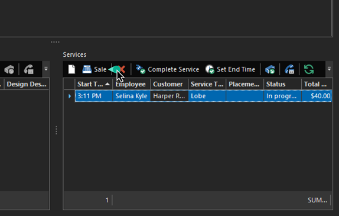
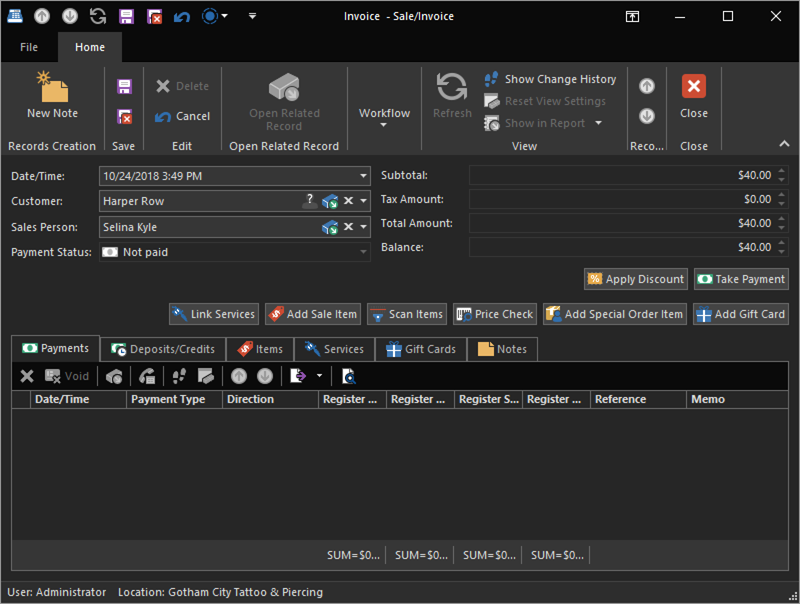
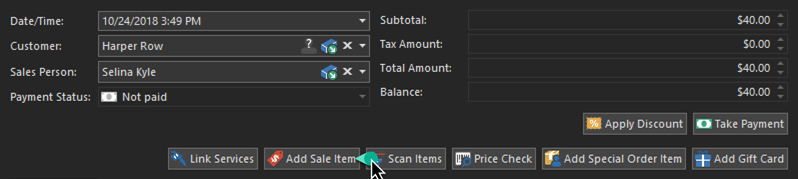
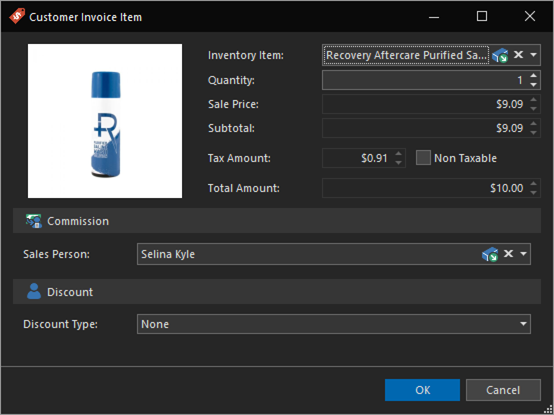
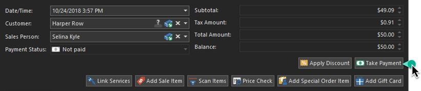

# Quick Start: Start a sale

Selina has just finished piercing the client. We have previously started the walk-in service, now it's time to collect payment from the client.

1. From the **Today Dashboard** select the service you want to complete.
2. Click the **Sale** action on the toolbar, or double click the Service to open it if you need to modify it and click the **Sale** action in the Service Detail View.

    

The Sale action will add this service to a sale and open the Sale Detail View. This is the point-of-sale screen for REV23 Desktop where we can add products and services, take payments, etc.. If this service was already added to a sale, it will open that existing sale rather than create a new one.

You should notice the **Subtotal**, **Tax Amount**, **Total Amount** and **Balance** editors have already added this service and you can find it in the Services tab. So far, the client owes `$40.00`. But she'd like to add some piercing aftercare.

## Add a sale item

3. Click the **Add Sale Item** action.

    

4. In the **Inventory Item** editor, we will select the piercing aftercare spray we created earlier, then click the **OK** button.

    

    The item is added to the sale, and our totals have been updated. The client now owes `$50.00`.

5. The client has everything she needs and is ready to pay. Click the **Take Payment** action. 

    

6. The client happens to have a crisp $50.00 bill in her purse and uses it (don't worry, she tipped Selina back at her station)! So leave the pre-set **Amount**, which is the total due, and click the **Cash** tile.

    

    > You can take a partial payment by altering the Amount in this window.

7. Once fully paid, you'll be prompted to print the receipt and aftercare. You can add/remove the checkboxes from the tiles by clicking the tiles of what you want or don't want to print. Then either click the **Print** or **Skip** tiles.
   
    

    > Hint: You can default these choices in Invoicing & Payment Options and Service Options. By setting your defaults to anything other than 'Prompt,' you will never see this screen, and everything should just print automatically, saving you some mouse clicks.

The service **Status** is now set to `Paid`. 

At this point, you can just close the Service Detail View (it was already saved automatically once the sale was fully paid) or click **Save & Close**. Save & Close is just a good habit to get into and is one of the most common actions you'll use.