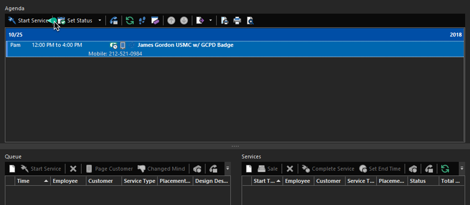
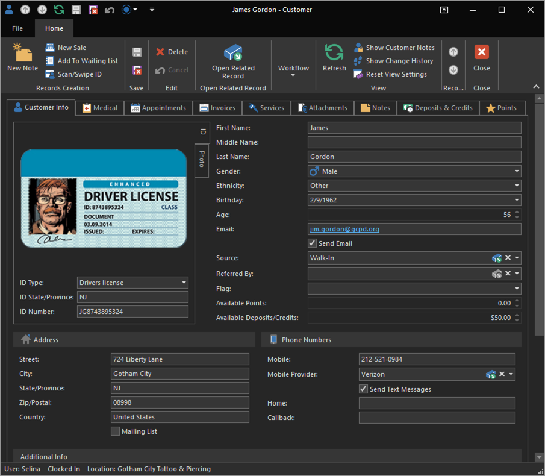
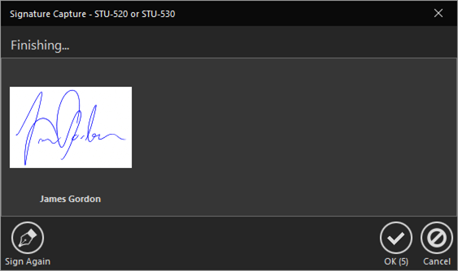
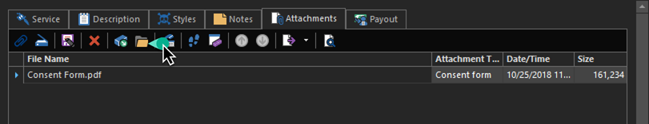
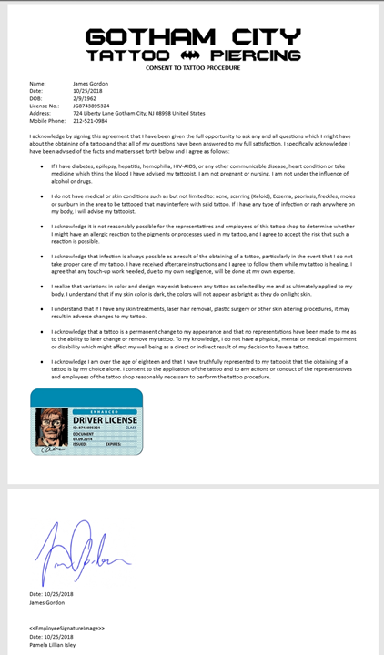

# Quick Start: Start a scheduled service

Yesterday, as Commissioner Gordon was on a jog, he stopped in and made an appointment for today. Well, it's time, and being ever so punctual, he's here and ready to get his new tattoo!

1. From the **Today Dashboard** observe the Agenda on the top. The agenda shows appointments that are coming up for the day. This view helps your users stay focused on what's happening, rather than bouncing from screen to screen.

2. Select the appointment from the Agenda and click the **Start Service** action. This will create a new service based on the details of the appointment and open the Service Detail View.

    

Now, we're in a service like we were when we created that [walk-in service](start-a-walk-in-service.md). The only difference here is that by using the **Start Service** action, the service knows it created from an appointment (so we can later track walk-in services vs scheduled appointments), and some of the info has been filled out for us already-- but not everything.

3. Because he was just jogging by when he decided to make an appointment, he didn't have his ID for us to scan at the time. We're also missing some important information such as his address. Click the **Open Related Record** action in the Customer editor. This will open the Customer Detail View for that customer.

    

> Pro-tip: The **Open Related Record** action is *extremely* useful. Learning to incorporate it into your flow will make you much more efficient.

4. Now that we have his ID, we can click the **Scan/Swipe ID** action in the Customer Detail View on the ribbon to easily and instantly populate the information we didn't get earlier, such as his address and ID number. Now, the next time the client is here, swiping his ID will recall this customer record and we avoid a duplicate record.

    

    We can make any other necessary additions, then click the Save & Close action to return to the Service Detail View.

    

5. At this point, this is just as simple as the service we did earlier! Back in the Service Detail View, we still have some additional things we need to set up.
   
   

    Add the following properties:
    - **Service Type:** `Tattoo`
    - **Placement Area:** `Back`
    - **Design Description:** `USMC w/ GCPD Badge`
    - **Amount:** `$500`

By default, the *Tattoo* service type is set to a `Custom` pricing type. With this pricing type, we're able to just type that amount in, unlike the walk-in service we did earlier, where the price was automatically set when we selected the service type.

6. The Signature Pad was delivered this morning and Selina's plugged it in. Click the **Sign Consent Form** action.

   

   The customer will be prompted to join the mailing list (optional) as well as review the Service Agreement (not the actual consent form since the signature pad cannot scroll text), then provide their signature.

   

    When the customer signs the consent form, the signed copy will be generated as a PDF and stored digitally in the database. Let's inspect it.

7. Click the **Attachments** tab.
8. Highlight the consent form and click the **Open** action.

    

    The Consent Form will open in your default PDF application. Inspect it to ensure it looks good and his signature appears. You can see that it is now using the Consent Form template we customized yesterday. There are a few more changes we could make to get this to print all on a single page, for example, utilizing tables to place the ID and the signature side by side, or changing the font size.

    

> While you don't need to inspect the release form each time, it's a good idea to check it out every once in a while, especially if you have recently made changes to your release form.

9. Click the **Save & Close** action to save this service.

Notice the Appointment has disappeared from the Agenda and is now in the Services list in the **Today Dashboard**.

Pam will be tattooing the Commissioner for a few hours, so we'll check back in when she's done and ready to take payment and apply his deposit.