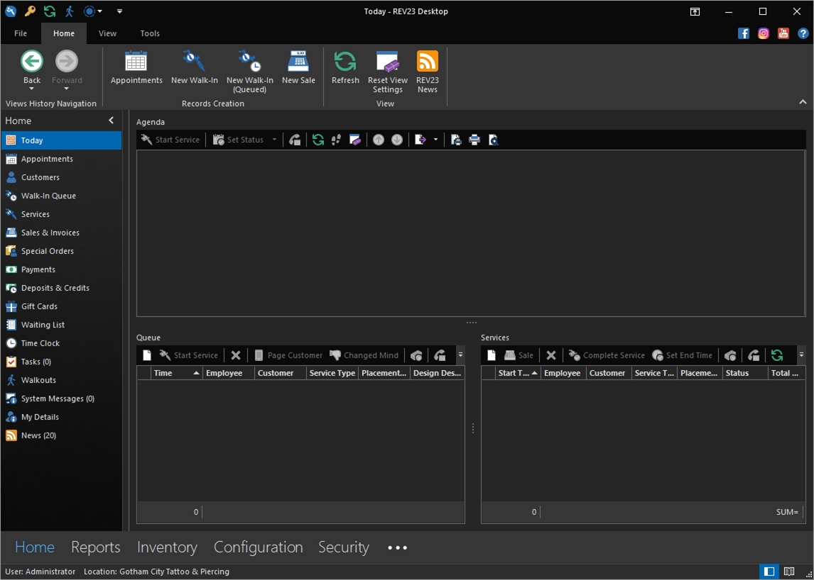
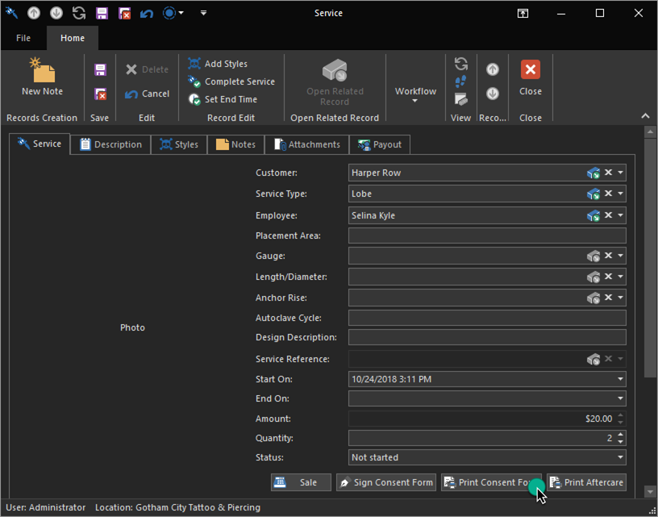

# Quick Start: Start a walk-in service

The appointment we scheduled isn't until tomorrow. Business must go on. Luckily, we have a body piercer hanging around to start taking some walk-in piercings. Let's see how a walk-in works.

1. From the Today Dashboard click the **New Walk-In** action.

    
    
2. In the Service Detail View, we'll set up the service. For services, we only need a few things to get it rolling. The extent you need to fill this out is up to your health department.

    

    + **Customer:** Required. Obviously.
    + **Service Type:** Required. The type of service you're performing.
    + **Employee:** Required. The employee providing the service.
    + **Placement Area:** Recommended. The placement of the service on the body. If a piercing (what we're doing in this case) the name of the piercing itself generally guides this and is unnecessary.
    + **Design Description:** Mostly for tattoos, or large piercing projects. A description of what is being done.
    + **Amount:** The amount you're charging for the service. Generally you'll only fill this editor out when dealing with tattoos, since in most cases, piercing prices are fixed and determined by the studio.

3. Like we saw when we scheduled an appointment for a customer, we can click the Customer editor to search for a customer by name, or create a new customer by clicking the New action or Scan/Swipe ID action. Since this client has her ID with her, we'll click the **Scan/Swipe ID** action to open the Customer Detail View and pre-fill that data in.

    By swiping the ID, we will obtain the following fields automatically without any typing: First name, middle name, last name, gender, birthday, address, driver's license number and state. We'll add a few more fields such as email and mobile phone + provider.

    The next time this client returns, swiping the ID will recall this record, including any changes we've  made.

    > Hint: If you do not yet have a bar code reader or magstripe stripe reader, when REV23 Desktop is waiting for you to to scan the ID, press the letter `D` on your keyboard to use demo data, which demonstrates the information that can be extracted from the ID.

4. Hover over the ID Image Editor. We can click the scan button in the Image Editor to acquire the ID Image from the document scanner.

    

5. After scanning the ID image, click the **Save & Close** action to return to the Service Detail View. This customer is now set in the Customer editor.

6. Select `Lobe` as the **Service Type**, and select `Selina` as the **Employee**. Notice that users that are not assigned to the selected Service Type do not show up in the user list, so when we clicked this editor, only Selina appeared because we [added her as a piercer](add-a-piercer.md).

    Because we've previously set the Lobe [piercing price](set-service-prices.md) in the previous section, the **Amount** has been defaulted for us and can not be modified.

7. Set the Quantity to 2, since our client wants both of her ear lobes pierced.

8. Click the **Print Consent Form** button to print a consent form for the customer to sign. Unlike other actions we've dealt with so far, these do not appear on the ribbon. Instead, some actions appear in the Detail View itself underneath the main group of editors we just filled out.
   
    

    > Hint: Hold the **SHIFT** key down on your keyboard while the **Print Consent Form** action to preview the consent form instead of printing it directly to the printer.

    If you have the Signature Pad, click the **Sign Consent Form** action instead.        

    

    The release form looks pretty good. There are a few things that stand out that we would like to fix (the phone number is using Home instead of the preferred Mobile), so we will come back to this later. For now, we have a release form that the client can sign.

9. Click the **Save & Close** action to save the record to return to the Service List View.

With the release form signed, Selina can now go do what she does best (well, second best after jewel heists) and pierce the client.

Next, we'll see how to charge the client for the service.